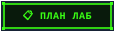
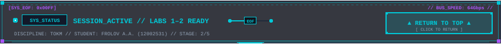

<div id="top"></div>

<div align="center">



<br/><br/>

<a href="#dossier"></a>
  &nbsp;
  <a href="#repos"></a>
  &nbsp;
  <a href="#plan"></a>
  &nbsp;
  <a href="#lab1"></a>
  &nbsp;
  <a href="#lab2"></a>
  &nbsp;
  <a href="#build"></a>

<br/><br/>


</div>

<br/>

<span id="dossier"></span>


<table width="100%">
<tr>
<td width="2000">

> 
>
> Репозиторий лабораторных работ по дисциплине **«Теоретические основы компьютерного моделирования»** (ТОКМ) с использованием графической библиотеки **GLScene**, меш-генератора **TetGen 1.5** и физического движка **Newton Dynamics** в среде **Embarcadero RAD Studio C++Builder**.

<br/>

* **Студент**: Фролов Артем Алексеевич
* **Группа**: 12002531 (2 курс магистратуры)
* **Университет**: НИУ «БелГУ», Институт инженерных и цифровых технологий (ИИЦТ)
* **Кафедра**: Математического и программного обеспечения информационных систем (МПОИС)
* **Преподаватель**: доц. Васильев Павел Владимирович
* **Курс в СДО «Пегас»**: <a href="https://pegas.bsuedu.ru/course/view.php?id=15521"></a>
* **GitHub репозиторий**: <a href="https://github.com/Kazinagg/bsu-tokm-lab2"></a>
* **Стадия сдачи**: Лабораторные работы 1–2 (накопительный репозиторий)

</td>
</tr>
</table>


<br/>

<span id="repos"></span>


<table width="100%">
<tr>
<td width="2000">

В соответствии с требованиями преподавателя, базовые проекты изучены и отмечены звёздочками ⭐:

1. <a href="https://github.com/glscene/GLXEngine"></a> — графический движок на базе OpenGL для C++Builder и Delphi.
2. <a href="https://github.com/glscene/AstrobloQ"></a> — система компьютерного моделирования астрономических объектов и плагинов лаб на C++Builder.

</td>
</tr>
</table>


<br/>

<span id="plan"></span>


<table width="100%">
<tr>
<td width="2000">

| № | Наименование лабораторной работы | Статус | Исходный код | Отчет (.docx) |
|:---:|---|:---:|:---:|:---:|
| **1** | **3D облако точек в объеме контейнеров (GLScene)**<br><sub>Стохастическое моделирование точечных и поверхностных тел в GLScene</sub> |  | <a href="lab1/"></a> | <a href="Л1%20Фролов.docx"></a> |
| **2** | **Точечная модель звёздного каталога HYG в динамике**<br><sub>Гарвардская классификация OBAFGKM, собственное движение, SQLite и Stars.csv</sub> |  | <a href="lab2/"></a> | <a href="Л2%20Фролов.docx"></a> |

<br/>


В репозитории размещен файл [`kommod.groupproj`](kommod.groupproj) (а также зеркальный `tokm.groupproj`), сконфигурированный для одновременной компиляции всех активных лабораторных работ (ЛР №1, ЛР №2) в единой рабочей среде.

</td>
</tr>
</table>


<br/>

<span id="lab1"></span>


<br/>


<table width="100%">
<tr>
<td width="2000">

<div align="left">
  <b>Файлы работы:</b>
  <a href="lab1/exp/Lab1/"></a>
  <a href="lab1/exp/Lab1/RandomStars.cbproj"></a>
  <a href="Л1%20Фролов.docx"></a>
</div>

<br/>

Проект разработан в папке [`lab1/exp/Lab1/`](lab1/exp/Lab1/) на C++Builder (`RandomStars.cbproj`).

### Реализованные задачи и алгоритмы:
1. **Шесть типов 3D-контейнеров с равномерной плотностью**:
   - **Кубический объем** ($1024 \times 1024 \times 1024$);
   - **Объем шара** (равномерное распределение $r = R \cdot \sqrt[3]{u}$, где $u \in [0, 1)$);
   - **Поверхность сферы** (изотропные углы $\phi \in [0, 2\pi)$, $\cos\theta \in [-1, 1]$);
   - **Цилиндрический объем** ($r = R \cdot \sqrt{u}$ для постоянной плотности по сечению);
   - **Поверхность цилиндра**;
   - **Конический объем** ($r = R(1 - h)\sqrt{u}$).
2. **Альтернативный режим вывода 3D-сфер (`TGLSphere`)**:
   - Создание динамических сфер с радиусом в диапазоне $[5, 25]$ единиц;
   - Применение 7 спектральных цветов радуги (**КОЖЗГСФ**);
   - Материалы со свойствами `Diffuse` и `Emission` для эффекта собственного свечения.
3. **Моделирование времени жизни и свечения звезд**:
   - В обработчике `TGLCadencer.OnProgress` реализован индивидуальный таймер свечения точек $[1, 100]$ секунд;
   - Линейное затухание яркости: $factor = curLife / maxLife$;
   - Автоматическое «перерождение» точек со случайным интервалом после угасания.
4. **Анализ производительности графического конвейера**:
   - Для массива из 100 000 точек частота кадров составляет 230–258 FPS при времени генерации менее 0.09 с;
   - В режиме полигональных 3D-сфер кадровая частота превышает 1200 FPS.

</td>
</tr>
</table>


<br/>

<span id="lab2"></span>


<br/>


<table width="100%">
<tr>
<td width="2000">

<div align="left">
  <b>Файлы работы:</b>
  <a href="lab2/project/"></a>
  <a href="lab2/project/HygViewer.cbproj"></a>
  <a href="Л2%20Фролов.docx"></a>
</div>

<br/>

Проект разработан в папке [`lab2/project/`](lab2/project/) на C++Builder (`HygViewer.cbproj`).

### Реализованные задачи и алгоритмы:
1. **Загрузка и парсинг астрометрического каталога**:
   - Чтение текстовых файлов `Stars.csv` (~120 000 звёзд) и выборки `Stars_mag65.csv` с нормализацией смещения колонок;
   - Поддержка параметров: координаты XYZ, звёздные величины mag/absmag, спектральные классы, векторы скоростей $v_x, v_y, v_z$.
2. **Цветовая классификация по Гарвардской шкале OBAFGKM**:
   - Дифференциация звёзд по температуре фотосферы: O (голубой), B (бело-голубой), A (белый), F (желто-белый), G (желтый, Солнце), K (оранжевый), M (красный);
   - Интерактивная фильтрация через компонент `TCheckListBox`.
3. **Кинематическая модель собственного движения звёзд**:
   - Моделирование смещения объектов во времени: $\vec{r}(t) = \vec{r}_0 + \vec{v} \cdot \Delta t$ в таймере `TGLCadencer`;
   - Вывод динамического модельного времени и текущего FPS в `TStatusBar`.
4. **Табличные инспекторы данных**:
   - Форма `TForm2` с компонентом `TDBGrid` для просмотра пространственных сеток SQLite (узлы `dt_node`, рёбра `dt_edge`, грани `dt_face`, тетраэдры `dt_ele`);
   - Форма `TFormStarsCSV` с компонентом `TListView` (режим `vsReport`) для просмотра, фильтрации и поиска по именам звёзд.
5. **Подтверждение авторства**:
   - Все формы, строковые панели статуса и диалоговое окно «Help $\rightarrow$ About» персонализированы для студента Фролова Артема Алексеевича (гр. 12002531).
   - Готовый отчёт: [`Л2 Фролов.docx`](Л2%20Фролов.docx).

</td>
</tr>
</table>


<br/>

<span id="build"></span>

<details open>
<summary><kbd>▶ BUILD_INSTRUCTIONS.SH // СБОРКА И ЗАПУСК</kbd> <b>[ НАЖМИТЕ ДЛЯ СВОРАЧИВАНИЯ / РАЗВОРАЧИВАНИЯ ]</b> <code>[STATE: EXPANDED]</code></summary>

<br/>


<table width="100%">
<tr>
<td width="2000">

```bash
# Клонирование репозитория
git clone https://github.com/Kazinagg/bsu-tokm-lab2.git
cd bsu-tokm-lab2
```

* **Среда разработки:** Embarcadero RAD Studio C++Builder 12 / 13;
* **Графический пакет:** GLScene (Open source OpenGL library for Delphi & C++Builder);
* **Компилятор:** Embarcadero Clang 32-bit / 64-bit;
* **Сборка через групповой проект:** откройте [`kommod.groupproj`](kommod.groupproj) в RAD Studio и выполните команду `Project -> Build All Projects`.

</td>
</tr>
</table>


</details>

<br/><br/>

<div align="center">

<a href="#top"></a>

<br/><br/>

<sub>ТОКМ &bull; BelSU / НИУ «БелГУ» &bull; ФРОЛОВ А.А. &bull; 2026</sub>

</div>
